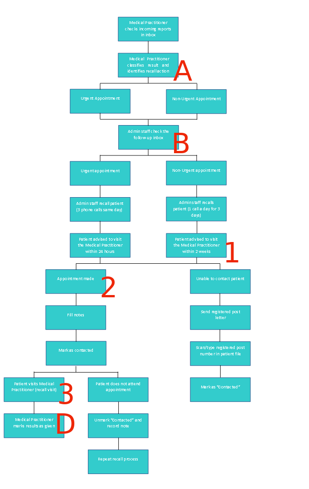
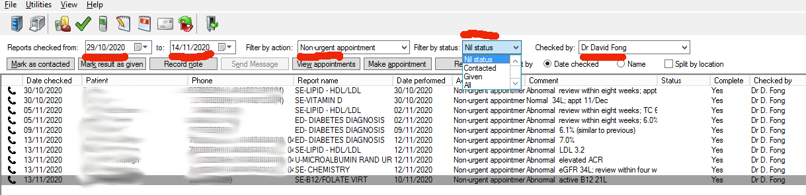
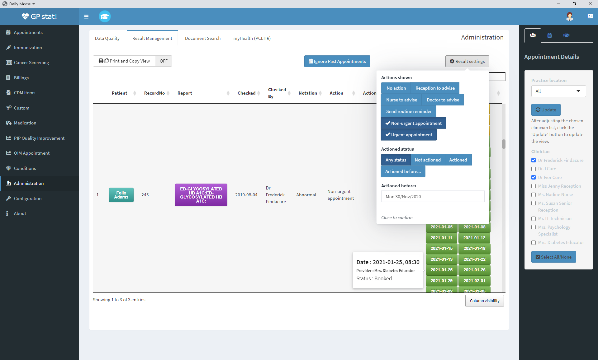

```{r setup, include=FALSE}
knitr::opts_chunk$set(echo = TRUE)
library(kableExtra)
library(magrittr)
```

# Introduction

A 'Theory of Change' is described, where the goal of a timely action and discussion
of results follows from the 'input' of a clinician marking a result as requiring action.

Parallels are described between the theory of change and the recall flowchart shown
in draft version 2 of the recall procedures.

The relationship between some key stages of the theory of change and the **Current**
recall procedure are compared and contrasted with proposal to add reminders (**Proposal.A**).
Potential minimal changes to resolve the issues addressed by **Proposal.A** are
described in **Minimal.Change.B**.

Notes describe how to view lists of results which are marked as 'non-urgent' and
not yet notified.

\newpage

# Theory of Change

\ 

*
](Theory Maker - ResultManagement.png){width=92%}

```{r include=FALSE, eval=FALSE}
# for Theory Maker theorymaker.info

-Goal; fillcolour = purple5; fontcolor = white; fontsize = 24
a; label = !heart Time-appropriate action and discussion of results which require discussion

-Outcomes; fillcolour = purple3; fontsize = 24
b; label = !do Patient contacts and communicates with clinician in appropriate timeframe after result requiring action is available (3)

-Output;fontsize = 24
c; label = Clinician communicating with the patient aware that result requires action

-Output - time-appropriate appointment to discuss result requiring action; fontsize = 20
d; label = !do Patient has time-appropriate appointment (for discussion of result) after the result requiring action is available for discussion (2)
 Patient already has an appointment within the appropriate timeframe

--No appointment in appropriate timeframe; colour = orange3
e; label = Patient makes an appointment within the appropriate timeframe
 Patient does not have an appointment within the appropriate timeframe

f; label = Patient is aware that result requires action, and requires an appointment

d
 e
  f

-Activity; fontsize = 24
--Clinic staff; colour = orange4
g; label = !do Patient contacted by clinic to make an appointment when a result requires discussion, especially if the patient does not already have an appointment with an appropriate timeframe (1)
 i; label = !do Clinic identifies a result requiring action (B)
 h; label = Clinic aware that no appointment has been made with appropriate timeframe

--Clinicians; colour = orange4
aa; label = !do Clinician views section of electronic medical record (Best Practice) containing result requiring action (C)


f
 g

-Input; fontsize = 24
j; label = !do Clinician marks result requiring action, indicating appropriate timeframe (A)

i
 j

aa
 j

a
 b
  d
 c
  aa

-
ba; label = !do Result requiring action is marked as notified (D)
bb; label = !do Initiating clinician aware that result requiring action has (or has not been) been actioned (E)

i
 (colour=red)ba
  a

bb
 ba
 (direction = both)i

proportion=1.2
direction=TB

```

\newpage

# Relationship between Theory of Change and Recall flowchart

Recall flowchart from version 2 of draft recall procedure.

Only a few relationships are described, with the letters **A**, **B** and **D** and numbers **1**, **2** and **3**.

{width=70%}

\newpage

# Relationship between Theory of Change and current, proposed or potential procedures

* **Current** : Recall system procedure for non-urgent results (2020 draft version 2)
* **Proposal.A** : Recall system using 'reminders' for non-urgent results
* **Minimal.Change.B** : Recall system based on **Current**, possible changes to fulfil aims of **Proposal.A**

\renewcommand{\arraystretch}{2}

```{r echo=FALSE}
knitr::kable(
  data.frame(
    Procedure = linebreak(
      c(
        "\n\\textbf{A}\n\nClinician marks\nresult requiring\naction",
        "\n\\textbf{B}\n\nClinic identifies\nresult requiring\naction",
        "\n\\textbf{C}\n\nClinician views\nsection of \\textit{Best}\n\\textit{Practice} containing\nresult requiring\naction",
        "\n\\textbf{D}\n\nResult requiring\naction is marked\nas notified",
        "\n\\textbf{E}\n\nInitiating clinician\naware result\nnotified or not"
      )),
    Current = linebreak(
      c(
        "Result marked\n 'non-urgent'",
        "Administration checks\n 'follow-up' inbox,\n same as for\n 'urgent' results",
        "Clinician checks\n investigation section\n of \\textit{Best Practice}\n during/before each\n appointment",
        "Clinician marks\n result as notified on\n investigation page",
        "\\textbf{No} procedure defined"
      )
    ),
    `Proposal A` = linebreak(
      c(
        "Result marked\n 'non-urgent',\n \\textbf{and} same result\n marked for 'reminder'",
        "Administration checks\n 'reminders', same as for\n cervical screening and\n follow-up colonoscopies",
        "Clinician sees\n 'reminder' notice at\n head of \\textit{Best}\n\\textit{Practice} page",
        "Same as 'Current',\n\\textbf{and} clinician removes\n reminder",
        "Clinician (or admin)\nsearches\n for overdue\nreminders"
      )
    ),
    `Minimal change B` = linebreak(
      c(
        "Result marked\n 'non-urgent',\n \\textbf{and} \\textit{optionally} same\n result marked for 'action'",
        "Same as for 'Current'",
        paste(
          "Same as for 'Current'",
          "\\textit{or}\n\n",
          "Clinician sees\n 'action' notice at\n head of \\textit{Best}\n\\textit{Practice} page",
          "\\textit{or}\n\n",
          "Clinician sees\n 'red' warning button\n in \\textit{Doctor's Control}\n \\textit{Panel}"
        ),
        "Same as 'Current'",
        "Clinician (or admin)\nsearches\n for old results\nnot notified"
      )
    )
  ),
  escape = FALSE,
  linesep = "\\addlinespace"
) %>%
  row_spec(0, bold = T)
```

\newpage

# Notes

## List of results marked 'non-urgent' and not yet notified

### Follow up inbox (Best Practice)

From *Best Practice* main menu, choose **Clinical - Follow up inbox**

* Choose required date range
* Filter by action 'Non-urgent appointment'
* Filter by status 'Nil status' (i.e. not 'Given'/notified)
  + May *also* need to check 'Contacted' (by administration staff, but still not 'Given'/notified by clinician)
* Choose the clinician who 'checked' the result ('Checked by')

{width=100%}

### GPstat! Result Management

*GPstat!* (written by David Fong) allows viewing of results, filtered
by clinician(s) seen, date range checked, action and actioned status. Comments attached
to the result, and upcoming appointments for the patient can also be viewed.

{width=100%}